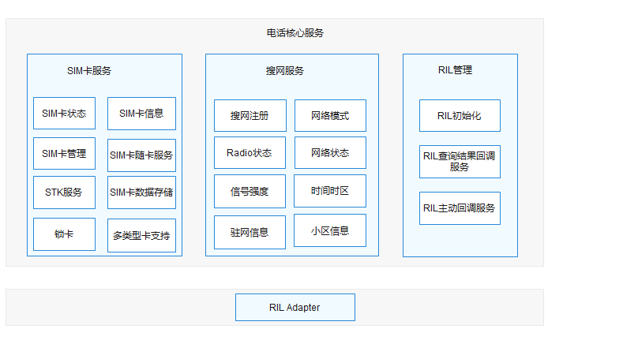

# 核心服务<a name="ZH-CN_TOPIC_0000001152064913"></a>

-   [简介](#section117mcpsimp)
-   [目录](#section129mcpsimp)
-   [约束](#section133mcpsimp)
-   [接口说明](#section139mcpsimp)
    -   [获取SIM卡信息相关接口](#section142mcpsimp)
    -   [搜网服务相关接口](#section198mcpsimp)

-   [使用说明](#section370mcpsimp)
    -   [搜网](#section393mcpsimp)
    -   [SIM卡](#section402mcpsimp)

-   [相关仓](#section409mcpsimp)

## 简介<a name="section117mcpsimp"></a>

电话核心服务模块主要功能是初始化RIL管理、SIM卡和搜网模块，以及获取RIL Adapter服务。

通过注册回调服务，实现与RIL Adapter进行通信；通过发布订阅，来实现与各功能模块的通信。

**图 1**  电话核心服务架构图<a name="fig5700192716219"></a>




上图示中电话核心服务关联的业务服务包括SIM卡服务、搜网服务、RIL通信管理。

-   SIM卡服务：主要是SIM卡初始化，文件读写，加载状态通知，单双卡控制。包括SIM卡状态查询、SIM卡管理、SIM卡控制、STK、联系人存储、短信存储。
-   搜网服务：主要是网络注册，网络状态获取。包括网络注册、网络模式查询、Radio状态查询、搜网管理、信号强度查询、小区管理、驻网管理、时间时区更新。
-   RIL管理：提供主动回调服务，查询结果回调服务等。

## 目录<a name="section129mcpsimp"></a>

```
/base/telphony/core_service
├── interfaces             # 接口目录
│   ├── innerkits          # 部件间的内部接口
│   └── kits               # 对应用提供的接口（例如JS接口）
├── services               # 核心服务实现代码目录
├── etc                    # 核心服务的驱动脚本目录
├── sa_profile             # 核心服务的启动文件目录
├── tel_ril                # 核心服务与RIL Adapter通信代码目录
├── network_search         # 搜网服务代码目录
├── sim                    # SIM卡服务代码目录
└── common
```

## 约束<a name="section133mcpsimp"></a>

-   开发语言：Java Script。
-   软件上，需要与以下服务配合使用：RIL适配（ril\_adapter），状态注册服务（state\_registry）。
-   硬件上，需要搭载的设备支持以下硬件：可以进行独立蜂窝通信的Modem以及SIM卡。

## 接口说明<a name="section139mcpsimp"></a>

电话核心服务模块需要提供SIM卡，搜网相关模块的接口。

### 获取SIM卡信息相关接口<a name="section142mcpsimp"></a>

<a name="table144mcpsimp"></a>
<table><thead align="left"><tr id="row150mcpsimp"><th class="cellrowborder" valign="top" width="33.406659334066596%" id="mcps1.1.4.1.1"><p id="entry151mcpsimpp0"><a name="entry151mcpsimpp0"></a><a name="entry151mcpsimpp0"></a>接口名称</p>
</th>
<th class="cellrowborder" valign="top" width="33.266673332666734%" id="mcps1.1.4.1.2"><p id="entry152mcpsimpp0"><a name="entry152mcpsimpp0"></a><a name="entry152mcpsimpp0"></a>接口描述</p>
</th>
<th class="cellrowborder" valign="top" width="33.32666733326668%" id="mcps1.1.4.1.3"><p id="entry153mcpsimpp0"><a name="entry153mcpsimpp0"></a><a name="entry153mcpsimpp0"></a>所需权限</p>
</th>
</tr>
</thead>
<tbody><tr id="row162mcpsimp"><td class="cellrowborder" valign="top" width="33.406659334066596%" headers="mcps1.1.4.1.1 "><p id="p109592823314"><a name="p109592823314"></a><a name="p109592823314"></a>function getSimState(slotId: number, callback: AsyncCallback&lt;SimState&gt;): void;</p>
</td>
<td class="cellrowborder" valign="top" width="33.266673332666734%" headers="mcps1.1.4.1.2 "><p id="entry164mcpsimpp0"><a name="entry164mcpsimpp0"></a><a name="entry164mcpsimpp0"></a>获取卡状态</p>
</td>
<td class="cellrowborder" valign="top" width="33.32666733326668%" headers="mcps1.1.4.1.3 "><p id="entry165mcpsimpp0"><a name="entry165mcpsimpp0"></a><a name="entry165mcpsimpp0"></a>无</p>
</td>
</tr>
<tr id="row178mcpsimp"><td class="cellrowborder" valign="top" width="33.406659334066596%" headers="mcps1.1.4.1.1 "><p id="entry179mcpsimpp0"><a name="entry179mcpsimpp0"></a><a name="entry179mcpsimpp0"></a>function getISOCountryCodeForSim(slotId: number, callback: AsyncCallback&lt;string&gt;): void;</p>
</td>
<td class="cellrowborder" valign="top" width="33.266673332666734%" headers="mcps1.1.4.1.2 "><p id="entry180mcpsimpp0"><a name="entry180mcpsimpp0"></a><a name="entry180mcpsimpp0"></a>获取国家码</p>
</td>
<td class="cellrowborder" valign="top" width="33.32666733326668%" headers="mcps1.1.4.1.3 "><p id="entry181mcpsimpp0"><a name="entry181mcpsimpp0"></a><a name="entry181mcpsimpp0"></a>无</p>
</td>
</tr>
<tr id="row182mcpsimp"><td class="cellrowborder" valign="top" width="33.406659334066596%" headers="mcps1.1.4.1.1 "><p id="p1441115133518"><a name="p1441115133518"></a><a name="p1441115133518"></a>function getSimOperatorNumeric(slotId: number, callback: AsyncCallback&lt;string&gt;): void;</p>
</td>
<td class="cellrowborder" valign="top" width="33.266673332666734%" headers="mcps1.1.4.1.2 "><p id="entry184mcpsimpp0"><a name="entry184mcpsimpp0"></a><a name="entry184mcpsimpp0"></a>获取运营商数字码</p>
</td>
<td class="cellrowborder" valign="top" width="33.32666733326668%" headers="mcps1.1.4.1.3 "><p id="entry185mcpsimpp0"><a name="entry185mcpsimpp0"></a><a name="entry185mcpsimpp0"></a>无</p>
</td>
</tr>
<tr id="row186mcpsimp"><td class="cellrowborder" valign="top" width="33.406659334066596%" headers="mcps1.1.4.1.1 "><p id="p1818291010352"><a name="p1818291010352"></a><a name="p1818291010352"></a>function getSimSpn(slotId: number, callback: AsyncCallback&lt;string&gt;): void;</p>
</td>
<td class="cellrowborder" valign="top" width="33.266673332666734%" headers="mcps1.1.4.1.2 "><p id="entry188mcpsimpp0"><a name="entry188mcpsimpp0"></a><a name="entry188mcpsimpp0"></a>获取SPN信息</p>
</td>
<td class="cellrowborder" valign="top" width="33.32666733326668%" headers="mcps1.1.4.1.3 "><p id="entry189mcpsimpp0"><a name="entry189mcpsimpp0"></a><a name="entry189mcpsimpp0"></a>无</p>
</td>
</tr>
</tbody>
</table>

### 搜网服务相关接口<a name="section198mcpsimp"></a>

<a name="table200mcpsimp"></a>
<table><thead align="left"><tr id="row206mcpsimp"><th class="cellrowborder" valign="top" width="33.33333333333333%" id="mcps1.1.4.1.1"><p id="entry207mcpsimpp0"><a name="entry207mcpsimpp0"></a><a name="entry207mcpsimpp0"></a>接口名称</p>
</th>
<th class="cellrowborder" valign="top" width="33.33333333333333%" id="mcps1.1.4.1.2"><p id="entry208mcpsimpp0"><a name="entry208mcpsimpp0"></a><a name="entry208mcpsimpp0"></a>接口描述</p>
</th>
<th class="cellrowborder" valign="top" width="33.33333333333333%" id="mcps1.1.4.1.3"><p id="entry209mcpsimpp0"><a name="entry209mcpsimpp0"></a><a name="entry209mcpsimpp0"></a>所需权限</p>
</th>
</tr>
</thead>
<tbody><tr id="row210mcpsimp"><td class="cellrowborder" valign="top" width="33.33333333333333%" headers="mcps1.1.4.1.1 "><p id="p611934143612"><a name="p611934143612"></a><a name="p611934143612"></a>function getRadioTech(slotId: number, callback: AsyncCallback&lt;{psRadioTech: RadioTechnology, csRadioTech: RadioTechnology}&gt;): void;</p>
</td>
<td class="cellrowborder" valign="top" width="33.33333333333333%" headers="mcps1.1.4.1.2 "><p id="entry212mcpsimpp0"><a name="entry212mcpsimpp0"></a><a name="entry212mcpsimpp0"></a>获取当前接入技术</p>
</td>
<td class="cellrowborder" valign="top" width="33.33333333333333%" headers="mcps1.1.4.1.3 "><p id="entry213mcpsimpp0"><a name="entry213mcpsimpp0"></a><a name="entry213mcpsimpp0"></a>ohos.permission.GET_NETWORK_INFO</p>
</td>
</tr>
<tr id="row226mcpsimp"><td class="cellrowborder" valign="top" width="33.33333333333333%" headers="mcps1.1.4.1.1 "><p id="p924781783614"><a name="p924781783614"></a><a name="p924781783614"></a>function getSignalInformation(slotId: number, callback: AsyncCallback&lt;Array&lt;SignalInformation&gt;&gt;): void;</p>
</td>
<td class="cellrowborder" valign="top" width="33.33333333333333%" headers="mcps1.1.4.1.2 "><p id="entry228mcpsimpp0"><a name="entry228mcpsimpp0"></a><a name="entry228mcpsimpp0"></a>获取信号列表</p>
</td>
<td class="cellrowborder" valign="top" width="33.33333333333333%" headers="mcps1.1.4.1.3 "><p id="entry229mcpsimpp0"><a name="entry229mcpsimpp0"></a><a name="entry229mcpsimpp0"></a>无</p>
</td>
</tr>
<tr id="row230mcpsimp"><td class="cellrowborder" valign="top" width="33.33333333333333%" headers="mcps1.1.4.1.1 "><p id="p22372373611"><a name="p22372373611"></a><a name="p22372373611"></a>function getNetworkState(slotId: number, callback: AsyncCallback&lt;NetworkState&gt;): void;</p>
</td>
<td class="cellrowborder" valign="top" width="33.33333333333333%" headers="mcps1.1.4.1.2 "><p id="entry232mcpsimpp0"><a name="entry232mcpsimpp0"></a><a name="entry232mcpsimpp0"></a>获取网络状态</p>
</td>
<td class="cellrowborder" valign="top" width="33.33333333333333%" headers="mcps1.1.4.1.3 "><p id="entry233mcpsimpp0"><a name="entry233mcpsimpp0"></a><a name="entry233mcpsimpp0"></a>ohos.permission.GET_NETWORK_INFO</p>
</td>
</tr>
</tbody>
</table>

>**说明：**
>RIL管理不对外暴露接口，其接口可通过电话服务子系统各个模块调用。

## 使用说明<a name="section370mcpsimp"></a>

### 搜网<a name="section393mcpsimp"></a>

以获取网络状态为例，相关流程如下：

1.  指定查询的slotId，若不指定默认查询主卡信息。
2.  可以通过callback或者Promise的方式调用getNetworkState方法，返回网络状态信息。
3.  该接口为异步接口，相关执行结果会从callback中返回。

    ```
    import radio from "@ohos.telephony.radio";

    // 参数赋值
    let slotId = 1;

    // 调用接口【callback方式】
    radio.getNetworkState(slotId, (err, value) => {
      if (err) {
        // 接口调用失败，err非空
        console.error(`failed to getNetworkState because ${err.message}`);
        return;
      }
      // 接口调用成功，err为空
      console.log(`success to getNetworkState: ${value}`);
    });

    // 调用接口【Promise方式】
    let promise = radio.getNetworkState(slotId);
    promise.then((value) => {
      // 接口调用成功，此处可以实现成功场景分支代码。
      console.log(`success to getNetworkState: ${value}`);
    }).catch((err) => {
      // 接口调用失败，此处可以实现失败场景分支代码。
      console.error(`failed to getNetworkState because ${err.message}`);
    });
    ```


### SIM卡<a name="section402mcpsimp"></a>

以查询指定SIM卡的状态为例，相关流程如下：

1.  指定查询的slotId。
2.  可以通过callback或者Promise的方式调用getSimState方法，返回卡状态信息。
3.  该接口为异步接口，相关执行结果会从callback中返回。

    ```
    import sim from "@ohos.telephony.sim";

    // 参数赋值
    let slotId = 1;

    // 调用接口【callback方式】
    sim.getSimState(slotId, (err, value) => {
      if (err) {
        // 接口调用失败，err非空
        console.error(`failed to getSimState because ${err.message}`);
        return;
      }
      // 接口调用成功，err为空
      console.log(`success to getSimState: ${value}`);
    });

    // 调用接口【Promise方式】
    let promise = sim.getSimState(slotId);
    promise.then((value) => {
      // 接口调用成功，此处可以实现成功场景分支代码。
      console.log(`success to getSimState: ${value}`);
    }).catch((err) => {
      // 接口调用失败，此处可以实现失败场景分支代码。
      console.error(`failed to getSimState because ${err.message}`);
    });
    ```


## 相关仓<a name="section409mcpsimp"></a>

[电话服务子系统](https://gitee.com/openharmony/docs/blob/master/zh-cn/readme/%E7%94%B5%E8%AF%9D%E6%9C%8D%E5%8A%A1%E5%AD%90%E7%B3%BB%E7%BB%9F.md)

**telephony_core_service**

[telephony_sms_mms](https://gitee.com/openharmony/telephony_sms_mms/blob/master/README_zh.md)